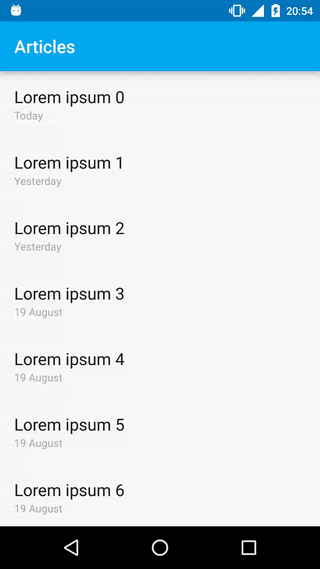
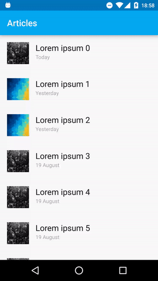

Android - Article details transition example
========

It's just some examples of material transitions.

Pop from top|Pop from item
-------------|-------------
|

References
========
 - "Pop from top" transition is inspired (more or less) by [Ivan Bjelajac's transition](http://www.materialup.com/posts/article-details-transition).
 - The project uses [ButterKnife](http://jakewharton.github.io/butterknife/).

License
========

[Apache License Version 2.0](LICENSE)
